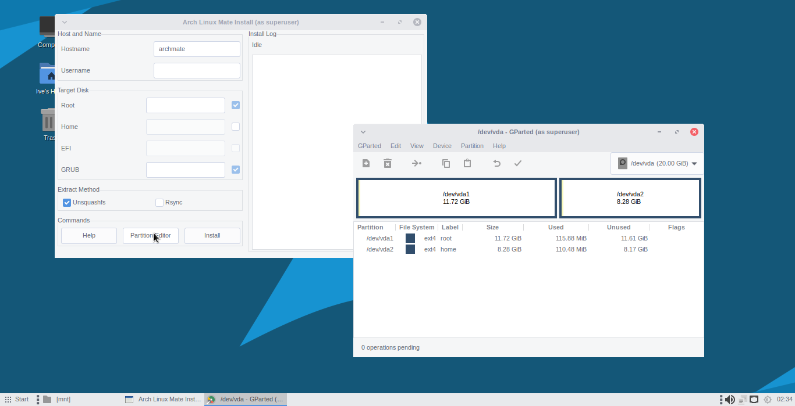

# Install Live ISO

There is a simple installer available in Live Session, written in Python wxGTK with Unsquashfs and Rsync to deploy files into disk.

## Start Installer

### Mate ISO

Using **Start Menu** -> **Administration** -> **ArchMate Install**


### Openbox ISO

First, start Openbox session using command:

```sh
startx /usr/bin/openbox-session
```

Then, open a XTerm terminal (using keyboard CTRL+T) and run command:

```sh
sudo python /usr/share/archmate-install/archmate_install.py
```


## Partitioning

First, the disk need to be partitioned with :
- a root partition, at least 8GB 12GB with ext4 filesystem.
- an optionally seperated home partition, with ext4 filesystem.
- a EFI partition to mounted at /boot/efi, with fat32 filesystem. This is only required if using UEFI.

Press the **Partition Editor** button and it will open GParted to manage partitions.

Example of partitions result:



## Installing to Disk

### Filling Form

For Username and Hostname, fill your preferreed Hostname and Username.

**NOTE:** You may only use alphabet (a-z,A-Z,1-0) characters, without space nor other special characters.

For Disks:
- Root disk address like /dev/vda1 in ext4. This is mandatory.
- Home disk address like /dev/vda2 in ext4. This is optional.
- EFI disk address like /dev/vda3 in fat32. This is mandatory if booting using UEFI.
- GRUB disk address like /dev/vda. This is mandatory.

Lastly, choose either using Unsquashfs or Rsync:
- Unsquashfs will go faster but requires multicore processors and memory 4GB or more.
- RSync will go slower but less resource demands.


### Start Installation

Click **Install** button, it will ask confirmation:


If confirmed, the installation process start:


### Finish

If shown this text:

```
Installation Finished
You can reboot manually
```

it means installation is done and the computer can be rebooted into disk installation.

## Installer Package

See here: [ArchMATE Install](https://github.com/mekatronik-achmadi/archmate/tree/main/pkgbuilds/custom/archmate-install/)
