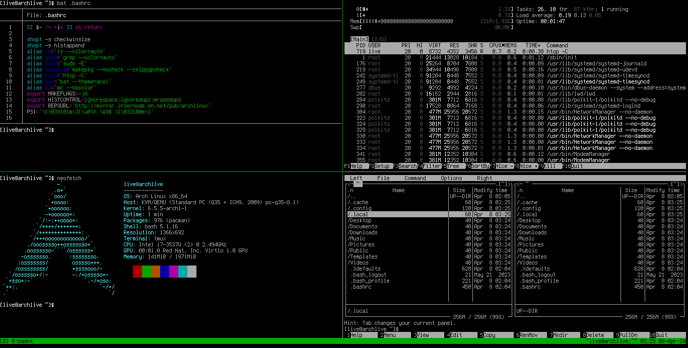

# Custom ArchISO

This section contains scripts to build a simple Arch-Linux ISO.
To try, there are two options:
- [Download Examples](#download-example)
    + [CLI Variant](#cli-variant)
    + [MATE Variant](#mate-variant)
- [Build Yourself](#build-yourself)
	+ [Brief](#brief)
	+ [Requirements](#requirements)
	+ [Preparation](#preparation)
	+ [Get Databases](#get-databases)
	+ [Get URL List](#get-url-list)
	+ [Get Packages](#get-packages)
    + [Prepare script](#prepare-script)
    + [Build ISO](#build-iso)
    + [Test ISO](#test-iso)

Any my custom package recipes that build these ISO can be found [here](https://github.com/mekatronik-achmadi/archmate/tree/main/pkgbuilds/custom).

## Download Example

There are two variants: Command Line Interface and MATE Desktop.
You can download from [SourceForge](https://sourceforge.net/projects/archlinux-custom-iso/files/archmate/).

### CLI variant

This ArchISO using CLI BASH as default interface and Openbox as optional.

CLI ISO automatically login into a BASH interface after booting using **live** user.


Using [TMux](https://github.com/tmux/tmux/wiki), you can have multiple CLI BASH.



Optionally, you can enter X11 Session with Openbox using command:

```sh
startx /usr/bin/openbox-session
```


### MATE variant

This ArchISO provide MATE Desktop and Openbox with LightDM as login manager.

After booting, it will show the LightDM to choose session:


If MATE desktop chosen, it will login into Mate desktop using **live** user.


## Build Yourself

### Brief

This method is basic ISO building using [Pacstrap](https://wiki.archlinux.org/title/Pacstrap) and [Archiso](https://wiki.archlinux.org/title/archiso).

**Warning:** This method guide only intended for Archiso version 58.

### Requirements

Some basic requirements:
- A computer with:
	+ At least 15GB free space disk. For more larger number of packages it may needs more
	+ 4GB RAM. Its recommended to use 8GB.
	+ Decent Processor. Pentium or lower aren't recommended.
	+ Decent stable internet connection.
	+ Running ArchLinux x86_64 operating system.
- My custom  archiso package from [here](https://github.com/mekatronik-achmadi/archmate/tree/main/pkgbuilds/custom/archmate-archiso). Reasons:
	+ Its basically archiso version 58
	+ It modify **/usr/bin/mkarchiso** and **/usr/bin/pactrap** script to be more "offline" manner.

	You can also modify them manually, using this [script](https://github.com/mekatronik-achmadi/archmate/blob/main/pkgbuilds/custom/archmate-archiso/pacstrap_modify).

### Preparation

**Notes:** For beginner purpose, custom package will not used in this guidelines, especially if requires compilation and dynamic linking.

First, install my custom archiso from [here](https://github.com/mekatronik-achmadi/archmate/tree/main/pkgbuilds/custom/archmate-archiso).

then, create structure folder and like this:

```
archiso_project
+-- local_repo
|	+-- pkg-minimal-x86_64.txt (or use your own)
|	+-- databases
|	|	+-- core.db
|	|	+-- extra.db
|	|	+-- ...
|	+-- packages
|	|	+-- custom
|	|	|	+-- ...
|	|	+-- official
|	|	|	+-- *.pkg.tar.zst
|	|	|	+-- ...
+-- build_iso
|	+-- pkg-minimal-x86_64.txt (or use your own)
|	+-- archiso_min.sh (or use your own)
```

For convinient, you can use this command to build folders above:

```sh
mkdir -p archiso_project/{local_repo/{databases,package/{custom,official}},build_iso}
```

and here some basic files:
- [pkg-minimal-x86_64.txt](https://github.com/mekatronik-achmadi/archmate/blob/main/archiso/minimal/pkg-minimal-x86_64.txt)
- [archiso_min.sh](https://github.com/mekatronik-achmadi/archmate/blob/main/archiso/minimal/archiso_min.sh)

### get databases

first, build a temporary root structure in **local_repo** folder:

```sh
cd local_repo/

mkdir -p tmproot/etc/
mkdir -p tmproot/var/lib/pacman/sync/
mkdir -p tmproot/var/cache/pacman/pkg/
```

then, set some shell variables:

```sh
export REPOURL='http://mirror.internode.on.net/pub/archlinux'
export ISOVER='cli_minimal'
export PKGLIST='pkg-minimal-x86_64.txt'
export PKGCUSTOM='false'
```

download the databases

```sh
cd databases/
wget -c $REPOURL/core/os/x86_64/core.db
wget -c $REPOURL/extra/os/x86_64/extra.db
wget -c $REPOURL/multilib/os/x86_64/multilib.db
cd ../
```

### get URL list

first a create simple pacman.conf using command:

```sh
export URLREPO="$REPOURL/\$repo/os/\$arch"
echo "[options]
HoldPkg           = pacman glibc
Architecture      = x86_64
SigLevel          = Never
LocalFileSigLevel = Never
ParallelDownloads = 5

[core]
Server = $URLREPO

[extra]
Server = $URLREPO

[multilib]
Server = $URLREPO
" | tee pacman.conf
```

then, copy everything to temporary root

```sh
cp -vf pacman.conf tmproot/etc/pacman.conf
rsync -avh databases/ tmproot/var/lib/pacman/sync/
rsync -avh packages/official/ tmproot/var/cache/pacman/pkg/
```

lastly, generate the URL list using command

```sh
sudo pacstrap_pkgurl -GM -C tmproot/etc/pacman.conf tmproot $(cat $PKGLIST) > pkgurl.txt
```

if there succeded, it will yield **pkgurl.txt** that contain all package URLs.

### get packages

now, you can download using wget:

```sh
cd packages/official/
wget -c -i ../../pkgurl.txt
cd ../../
```

### prepare script

before build the iso, first go to the **build_iso** folder and set shell variabel like previous

```sh
cd ../build_iso/

export REPOURL='http://mirror.internode.on.net/pub/archlinux'
export ISOVER='cli_minimal'
export PKGLIST='pkg-minimal-x86_64.txt'
export PKGCUSTOM='false'
```

then adjust some variables inside the script **archiso_min.sh**  at line 10 to 18, according to your folder. For example:

```sh
export ISONAME='minimal'
export DIRPATH="../local_repo/"
export PKGLIST='pkg-minimal-x86_64.txt'
export PKGCUSTOM='false'
```

**TIPS:** Its encouraged to read the script throughly as this script prepare the ISO's root more in details.

### build iso

next step, is build the actual ISO using files from **local_repo**, that can be started using command:

```sh
sudo ./archiso_min.sh
```

wait for a while as the pacstrap build the root and compressing squashfs takes time.

**TIPS:** If the build process need to repeated, or just to save disk space, delete the **archlive** folder using root privillage, after the ISO succesfully build.

### test iso

You can test the ISO using [QEMU](https://wiki.archlinux.org/title/QEMU) with hypervisor like [KVM](https://wiki.archlinux.org/title/KVM) or [Xen](https://wiki.archlinux.org/title/Xen).

Use command like (for KVM):

```sh
qemu-system-x86_64 -enable-kvm \
-display gtk,grab-on-hover=on,\
zoom-to-fit=on,show-menubar=off \
-m 2048M -cpu host -smp 2 \
-vga virtio -monitor stdio \
-machine type=q35,accel=kvm \
-boot d -cdrom archlinux-minimal-x86_64.txt
```
