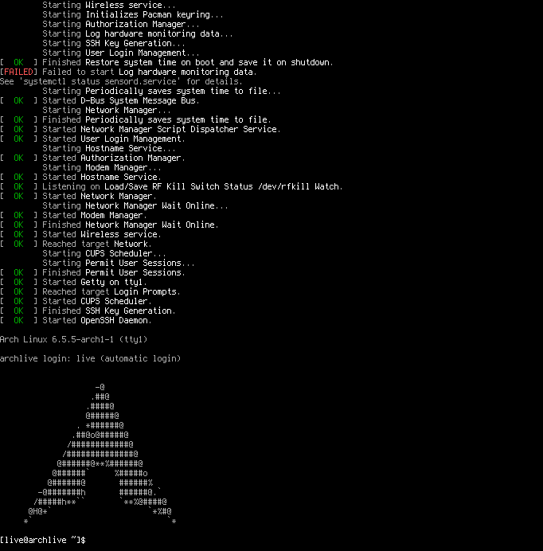
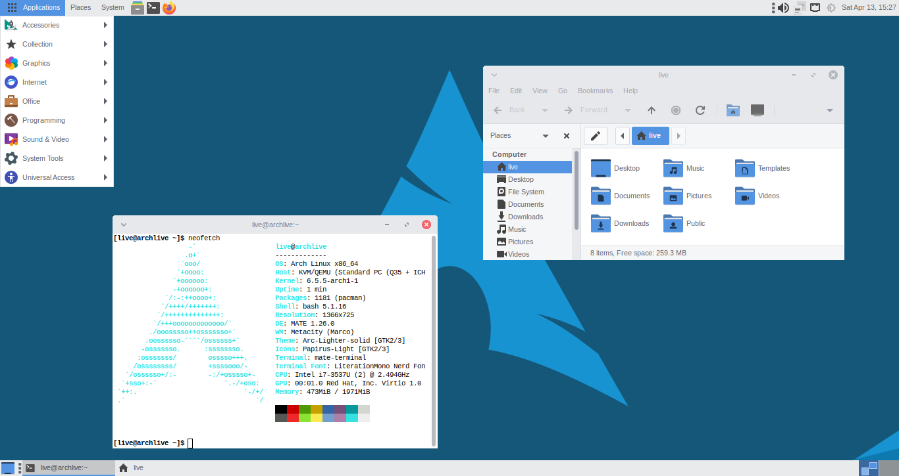

# Custom ArchISO

This section contains scripts to build a simple Arch-Linux ISO.
To try, there are two options:
- [Download Examples](#download-example)
    + [CLI Variant](#cli-variant)
    + [MATE Variant](#mate-variant)
- [Build Yourself](#build-yourself)

Any my custom package recipes that build these ISO can be found [here](https://github.com/mekatronik-achmadi/archmate/tree/main/pkgbuilds/custom).

## Download Example

There are two variants: Command Line Interface and MATE Desktop.
You can download from [SourceForge]().

### CLI variant

This ArchISO using CLI BASH as default interface and Openbox as optional.

CLI ISO automatically login into a BASH interface after booting using **live** user.



Using [TMux](https://github.com/tmux/tmux/wiki), you can have multiple CLI BASH.


Optionally, you can enter X11 Session with Openbox using command:

```sh
startx /usr/bin/openbox-session
```


### MATE variant

This ArchISO provide MATE Desktop and Openbox with LightDM as login manager.

After booting, it will show the LightDM to choose session:


If MATE desktop chosen, it will login into Mate desktop using **live** user.



## Build Yourself

### Brief

This method is basic ISO building using [Pacstrap](https://wiki.archlinux.org/title/Pacstrap) and [Archiso](https://wiki.archlinux.org/title/archiso).

**Warning:** This method guide only intended for Archiso version 58.

### Requirements

Some basic requirements:
- A computer with:
	+ At least 15GB free space disk. For more larger number of packages it may needs more
	+ 4GB RAM. Its recommended to use 8GB.
	+ Decent Processor. Pentium or lower aren't recommended.
- My custom  archiso package from [here](https://github.com/mekatronik-achmadi/archmate/tree/main/pkgbuilds/custom/archmate-archiso). Reasons:
	+ Its basically archiso version 58
	+ It modify mkarchiso and pactrap script to be more "offline" manner. You can also modify them manually using this [script](https://github.com/mekatronik-achmadi/archmate/blob/main/pkgbuilds/custom/archmate-archiso/pacstrap_modify).
	
### Preparation

**Notes:** For beginner purpose, custom package will be disable in this guidelines, especially if requires compilation and dynamic linking.

First create structure folder like this