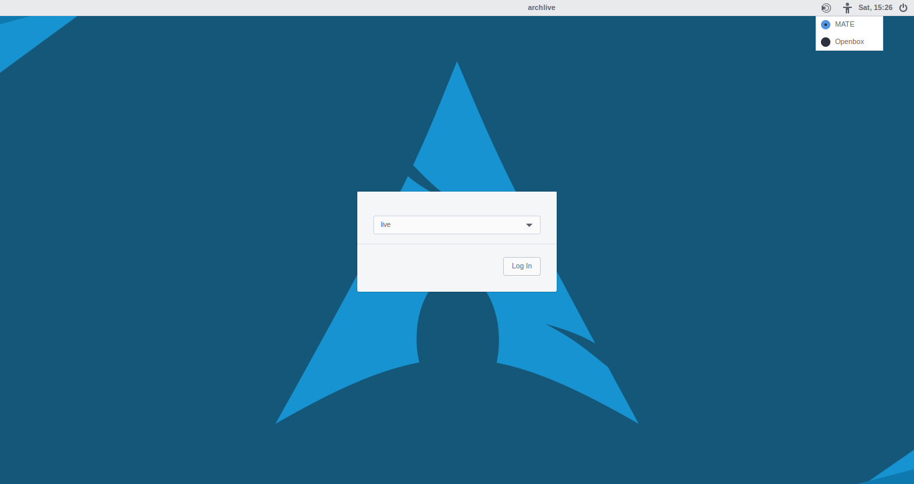
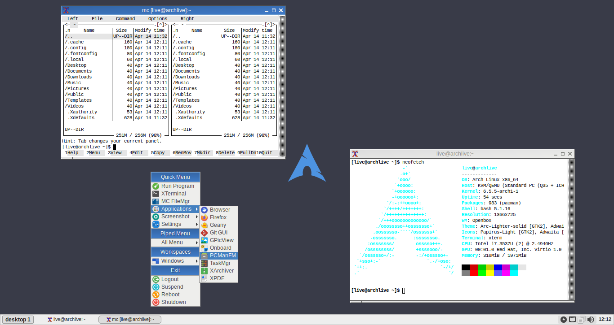

# Arch-Linux Custom ISO

This is just example of custom Arch-Linux ISOs using Archiso dan Pacstrap tools.

**NOTE:** This works done by myself just as a hobby and I had no any relation to amazing people in Arch-Linux Dev Team.

## ISO Variants

### Mate Desktop

The **archlinux-mate_012024-x86_64.iso** contain Mate Desktop and Openbox WM with LightDM as Login Manager.




### Command Line Interface

The **archlinux-cli_012024-x86_64.iso** contain Bash interface as default with additional Openbox WM.


The Openbox WM can be started using command:

```sh
startx /usr/bin/openbox-session
```



## Project Repository

You are free to visit this project repository on Github:

https://github.com/mekatronik-achmadi/archmate/tree/main/archiso


