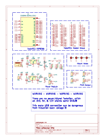
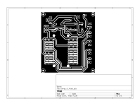
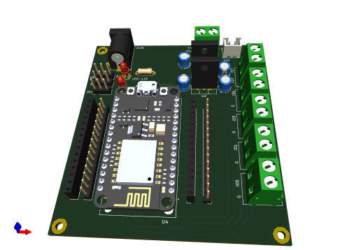

# Design Summary

[//]:<> (Convert PDF: Ghostwriter -> Export -> Pandoc GFM -> Format PDF Latex)

## Description

This circuit design are NodeMCU ESP8266 based module to control a halogen lamp.

**WARNING:**
There are no power/signal isolation, which all 3V3, 5V, & 12V shares same GND.
This make USB connection can be dangerous from induction back voltage.

## Schematic

[//]:<> (KiCAD Schematic: File -> Plot -> SVG)

## Layout

[//]:<> (KiCAD PCB: File -> Plot -> SVG)
[//]:<> (Drawing Sheet | Black & White)

## Preview

[//]:<> (KiCAD PCB: View -> 3D Viewer | File -> Export PNG)

## Bill of Material

### Material List

[//]:<> (KiCAD PCB: File -> Fabrication Output -> BOM)
[//]:<> (https://www.convertcsv.com/csv-to-markdown.htm)

|Id |Designator |Footprint                                       |Quantity|Designation           |
|---|-----------|------------------------------------------------|--------|----------------------|
|1  |J8         |TerminalBlock_Altech_AK300-2_P5.00mm            |1       |PSU                   |
|2  |H4,H2,H3,H1|MountingHole_2.5mm_Pad                          |4       |MountingHole_Pad      |
|3  |U4         |MODULE_ZC563900                                 |1       |ZC563900 NodeMCU ESP12|
|4  |C1,C3,C4,C2|CP_Radial_D5.0mm_P2.50mm                        |4       |100uF                 |
|5  |J4,J3      |PinSocket_1x15_P2.54mm_Vertical                 |2       |Conn_01x15_Socket     |
|6  |J14        |TerminalBlock_Altech_AK300-2_P5.00mm            |1       |OUT1                  |
|7  |J17        |TerminalBlock_Altech_AK300-2_P5.00mm            |1       |OUT4                  |
|8  |D2,D1      |LED_D3.0mm                                      |2       |PINK                  |
|9  |J2,J1      |PinHeader_1x15_P2.54mm_Vertical                 |2       |Conn_01x15_Pin        |
|10 |U2         |TO-220F-3_Vertical                              |1       |L7805                 |
|11 |J12        |PinHeader_1x03_P2.54mm_Vertical                 |1       |5V                    |
|12 |J10        |TerminalBlock_Altech_AK300-2_P5.00mm            |1       |FET                   |
|13 |R1,R2      |R_Axial_DIN0207_L6.3mm_D2.5mm_P7.62mm_Horizontal|2       |560                   |
|14 |J9         |JST_XH_B2B-XH-A_1x02_P2.50mm_Vertical           |1       |FAN                   |
|15 |J16        |TerminalBlock_Altech_AK300-2_P5.00mm            |1       |OUT3                  |
|16 |J11        |PinHeader_1x03_P2.54mm_Vertical                 |1       |3V3                   |
|17 |J15        |TerminalBlock_Altech_AK300-2_P5.00mm            |1       |OUT2                  |
|18 |J7         |BarrelJack_Horizontal                           |1       |Barrel_Jack_Switch    |
|19 |J13        |PinHeader_1x03_P2.54mm_Vertical                 |1       |GND                   |
|20 |U3         |TO-220F-3_Vertical                              |1       |L7812                 |
|21 |JP1        |SolderJumper-2_P1.3mm_Open_RoundedPad1.0x1.5mm  |1       |Jumper_2_Open         |

### Purchasing List

|item           |qty|url                           |
|---------------|---|------------------------------|
|terminal block 2p|8  |[Tokped](https://www.tokopedia.com/pcmelektronik/terminal-block-pcb-2pin-biru-kf300)|
|nodemcu esp8266|1  |[Tokped](https://www.tokopedia.com/pcmelektronik/esp8266-ch340-nodemcu-wifi-lolin-lua-esp-8266-modul)|
|header male    |4  |[Tokped](https://www.tokopedia.com/pcmelektronik/pin-header-male-1x40-single)|
|header female  |2  |[Tokped](https://www.tokopedia.com/pcmelektronik/female-header-pin-header-40-pin-female-1x40-lurus)|
|led 3mm        |4  |[Tokped](https://www.tokopedia.com/pcmelektronik/dioda-led-hijau-3-mm-hijau-hijau)|
|resistor 560   |4  |[Tokped](https://www.tokopedia.com/pcmelektronik/resistor-0-5w-1-2-w-560-ohm-560ohm)|
|elco 16v       |6  |[Tokped](https://www.tokopedia.com/pcmelektronik/2200uf-16v-elco-2200-16v-nipon-chimicon-hitam)|
|7805           |2  |[Tokped](https://www.tokopedia.com/pcmelektronik/promo-transistor-ic-regulator-l-7805-l7805-to-220)|
|7812           |2  |[Tokped](https://www.tokopedia.com/pcmelektronik/promo-ic-regulator-7812-l7812)|
|dc jack        |2  |[Tokped](https://www.tokopedia.com/pcmelektronik/promo-socket-power-dc-female-2-1x5-5-black-3-pin-berkwalitas)|
|HX2.54 2p      |2  |[Tokped](https://www.tokopedia.com/rajacell/1set-xh2-54-2p-connector-socket-terminal-pcb-xh-2pin-pitch-2-54mm)|
|PreOrder PCB   |1  |[Tokped](https://www.tokopedia.com/raftech/jasa-cetak-pcb-general)|
